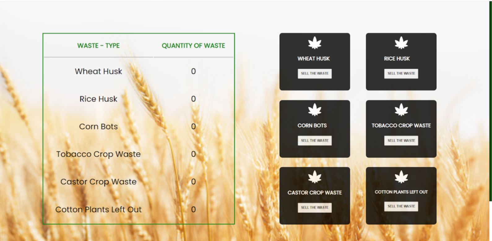

# WasteWise
A web app for the farmers

### Introduction

This web application is an approach to connect farmers and bio-waste industries together for the better management of the farm-waste produced.

### Screenshot

### Tech stack

**Frontend**
- React.js, Material UI, CSS

**Backend**
- Node.js, express.js, mongodb, mongoose
